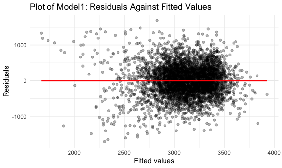
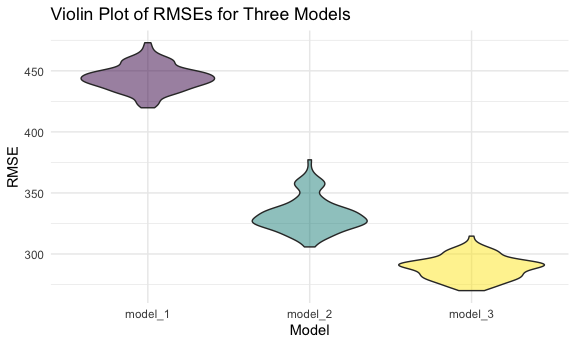
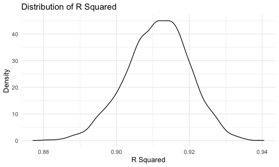
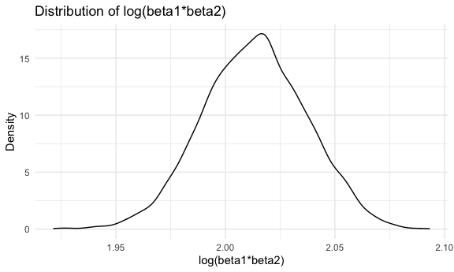

p8105\_hw6\_yc4018
================
Yuxuan Chen
12/3/2021

``` r
library(tidyverse)
library(modelr)
library(mgcv)

knitr::opts_chunk$set(
  fig.width = 6,
  fig.asp = .6,
  out.width = "90%"
)

theme_set(theme_minimal() + theme(legend.position = "bottom"))

options(
  ggplot2.continuous.colour = "viridis", 
  ggplot2.continuous.fill = "viridis" 
)

scale_colour_discrete = scale_colour_viridis_d
scale_fill_discrete = scale_fill_viridis_d

set.seed(1)
```

### **Problem 1**

1.  Load and clean the data for regression analysis

``` r
birthweight_df = 
  read.csv("./data/birthweight.csv") %>% 
  mutate(
    babysex = as.factor(babysex),
    frace = as.factor(frace),
    malform = as.factor(malform),
    mrace = as.factor(mrace))
knitr::kable(birthweight_df[0:10,])
```

| babysex | bhead | blength |  bwt | delwt | fincome | frace | gaweeks | malform | menarche | mheight | momage | mrace | parity | pnumlbw | pnumsga |    ppbmi | ppwt | smoken | wtgain |
|:--------|------:|--------:|-----:|------:|--------:|:------|--------:|:--------|---------:|--------:|-------:|:------|-------:|--------:|--------:|---------:|-----:|-------:|-------:|
| 2       |    34 |      51 | 3629 |   177 |      35 | 1     |    39.9 | 0       |       13 |      63 |     36 | 1     |      3 |       0 |       0 | 26.27184 |  148 |      0 |     29 |
| 1       |    34 |      48 | 3062 |   156 |      65 | 2     |    25.9 | 0       |       14 |      65 |     25 | 2     |      0 |       0 |       0 | 21.34485 |  128 |      0 |     28 |
| 2       |    36 |      50 | 3345 |   148 |      85 | 1     |    39.9 | 0       |       12 |      64 |     29 | 1     |      0 |       0 |       0 | 23.56517 |  137 |      1 |     11 |
| 1       |    34 |      52 | 3062 |   157 |      55 | 1     |    40.0 | 0       |       14 |      64 |     18 | 1     |      0 |       0 |       0 | 21.84508 |  127 |     10 |     30 |
| 2       |    34 |      52 | 3374 |   156 |       5 | 1     |    41.6 | 0       |       13 |      66 |     20 | 1     |      0 |       0 |       0 | 21.02642 |  130 |      1 |     26 |
| 1       |    33 |      52 | 3374 |   129 |      55 | 1     |    40.7 | 0       |       12 |      66 |     23 | 1     |      0 |       0 |       0 | 18.60030 |  115 |      0 |     14 |
| 2       |    33 |      46 | 2523 |   126 |      96 | 2     |    40.3 | 0       |       14 |      72 |     29 | 2     |      0 |       0 |       0 | 14.27034 |  105 |      0 |     21 |
| 2       |    33 |      49 | 2778 |   140 |       5 | 1     |    37.4 | 0       |       12 |      62 |     19 | 1     |      0 |       0 |       0 | 21.81089 |  119 |      0 |     21 |
| 1       |    36 |      52 | 3515 |   146 |      85 | 1     |    40.3 | 0       |       11 |      61 |     13 | 1     |      0 |       0 |       0 | 19.88106 |  105 |      0 |     41 |
| 1       |    33 |      50 | 3459 |   169 |      75 | 2     |    40.7 | 0       |       12 |      64 |     19 | 2     |      0 |       0 |       0 | 24.94123 |  145 |      4 |     24 |

``` r
# check for missing data
sum(is.na(birthweight_df))
```

    ## [1] 0

-   The dimension of this `birthweight_df` dataset is (4342, 20).
    Through data cleaning, I changed the `babysex`, `frace`, `malform`,
    and `mrace` these categorical variables from numeric to factor.
    Also, after checking for missing data, there are no missing values
    in this dataset.

2.  Propose a regression model for birthweight

-   After searching online, I found out that the premature birth,
    mother’s race, age, and health, multiple birth, and whether or not
    she smokes are the majority causes of low birthweight. Hence, I
    choose gestational age in weeks (`gaweeks`), mother’s race
    (`mrace`), mother’s age at delivery (`momage`), mother’s
    pre-pregnancy BMI (`ppbmi`), number of live births prior to this
    pregnancy (`parity`), and average number of cigarettes smoked per
    day during pregnancy(`smoken`) as predictors to predict child’s
    birthweight.

``` r
model_fit1 = lm(bwt ~ gaweeks + mrace + momage + ppbmi + parity + smoken, data = birthweight_df)
broom::tidy(model_fit1)
```

    ## # A tibble: 9 × 5
    ##   term        estimate std.error statistic   p.value
    ##   <chr>          <dbl>     <dbl>     <dbl>     <dbl>
    ## 1 (Intercept)  608.      102.        5.97  2.60e-  9
    ## 2 gaweeks       59.3       2.18     27.2   8.67e-151
    ## 3 mrace2      -293.       15.5     -18.9   2.91e- 76
    ## 4 mrace3      -135.       69.0      -1.96  5.04e-  2
    ## 5 mrace4      -200.       30.4      -6.60  4.63e- 11
    ## 6 momage         0.202     1.88      0.108 9.14e-  1
    ## 7 ppbmi         16.3       2.14      7.60  3.72e- 14
    ## 8 parity       115.       65.6       1.76  7.93e-  2
    ## 9 smoken       -11.0       0.938   -11.7   2.27e- 31

3.  plot of model residuals against fitted values

``` r
birthweight_df %>% 
  modelr::add_predictions(model_fit1) %>% 
  modelr::add_residuals(model_fit1) %>% 
  ggplot(aes(x = pred, y = resid)) +
  geom_point(alpha = .3) +
  geom_smooth(method = "lm", se = FALSE, color = "red") +
  labs(
    title = "Plot of Model1: Residuals Against Fitted Values",
    x = "Fitted values",
    y = "Residuals")
```



4.  Fit two other models:

-   One using length at birth and gestational age as predictors (main
    effects only)

``` r
model_fit2 = lm(bwt ~ blength + gaweeks, data = birthweight_df)
```

-   One using head circumference, length, sex, and all interactions
    (including the three-way interaction) between these

``` r
model_fit3 = lm(bwt ~ bhead + blength + babysex + bhead * blength + 
                  bhead * babysex + blength * babysex + bhead * blength * babysex, data = birthweight_df)
```

5.  Compute rmse: cross validation.

``` r
cv_df = 
  crossv_mc(birthweight_df, 100) %>% 
  mutate(
    train = map(train, as_tibble),
    test = map(test, as_tibble))

cv_df = 
  cv_df %>% 
  mutate(
    model_fit1 = map(.x = train, ~lm(bwt ~ gaweeks + mrace + momage + ppbmi + parity + smoken, data = .x)),
    model_fit2 = map(.x = train, ~lm(bwt ~ blength + gaweeks, data = .x)),
    model_fit3 = map(.x = train, ~lm(bwt ~ bhead + blength + babysex + bhead * blength + 
                                       bhead * babysex + blength * babysex + bhead * blength * babysex, data = .x))) %>% 
  mutate(
    rmse_model_1 = map2_dbl(.x = model_fit1, .y = test, ~rmse(model = .x, data = .y)), 
    rmse_model_2 = map2_dbl(.x = model_fit2, .y = test, ~rmse(model = .x, data = .y)),
    rmse_model_3 = map2_dbl(.x = model_fit3, .y = test, ~rmse(model = .x, data = .y)))
```

6.  violin plot of RMSEs

``` r
cv_df %>% 
  select(starts_with("rmse")) %>% 
  pivot_longer(
    everything(),
    names_to = "model", 
    values_to = "rmse",
    names_prefix = "rmse_") %>% 
  ggplot(aes(x = model, y = rmse)) +
  geom_violin() +
  labs(
     title = "Violin Plot of RMSEs for Three Models",
     x = "Model",
     y = "RMSE")
```



-   Based on the above violin plot of RMSEs for three models, since the
    model 3 has the smallest RMSE value, it is the best model; and the
    model 1 which with the largest RMSE value is the worst model. Hence,
    model 3, the model that has highest prediction accuracy, is the one
    to use `head circumference`, `length`, `sex`, and all interactions
    as predictors to predict child’s birthweight.

### **Problem 2**

``` r
weather_df = 
  rnoaa::meteo_pull_monitors(
    c("USW00094728"),
    var = c("PRCP", "TMIN", "TMAX"), 
    date_min = "2017-01-01",
    date_max = "2017-12-31") %>%
  mutate(
    name = recode(id, USW00094728 = "CentralPark_NY"),
    tmin = tmin / 10,
    tmax = tmax / 10) %>%
  select(name, id, everything())
```

``` r
weather_boot_results = 
  weather_df %>%
    bootstrap(5000, id = "strap_number") %>% 
    mutate(
      models = map(.x = strap, ~lm(tmax ~ tmin, data = .x)),
      results_r = map(models, broom::glance),
      results_log = map(models, broom::tidy)
    ) %>% 
    select(strap_number, results_r, results_log) %>% 
    unnest(results_r, results_log) %>% 
  select(strap_number, adj.r.squared, term, estimate) %>% 
  pivot_wider(
    names_from = term,
    values_from = estimate
  ) %>% 
  janitor::clean_names() %>% 
  mutate(
    log_beta1beta2 = log(intercept * tmin)
  ) %>% 
  select(strap_number, adj_r_squared, log_beta1beta2)
```

1.  Plot the distribution of *r̂*<sup>2</sup>

``` r
weather_boot_results %>% 
  ggplot(aes(x = adj_r_squared)) +
  geom_density() + 
  labs(
    title = c("Distribution of Adjusted R Squared"),
    x = c("Adjusted R Squared"),
    y = c("Density")
  )
```



-   Based on the above plot we can see that, the distribution of
    *r̂*<sup>2</sup> is nearly normally distributed around the mean of
    roughly 0.912.

2.  Plot the distribution of
    *l**o**g*(*β̂*<sub>0</sub> \* *β̂*<sub>1</sub>):

``` r
weather_boot_results %>% 
  ggplot(aes(x = log_beta1beta2)) +
  geom_density() + 
  labs(
    title = c("Distribution of log(beta1*beta2)"),
    x = c("log(beta1*beta2)"),
    y = c("Density")
  )
```



-   Based on the above plot we can see that, the distribution of
    *l**o**g*(*β̂*<sub>0</sub> \* *β̂*<sub>1</sub>) is nearly normally
    distributed around the mean of roughly 2.02.

3.  95% confidence interval for *r̂*<sup>2</sup> and
    *l**o**g*(*β̂*<sub>0</sub> \* *β̂*<sub>1</sub>):

``` r
weather_boot_results %>% 
  summarize(
    ci_lower_r = quantile(adj_r_squared, 0.025),
    ci_upper_r = quantile(adj_r_squared, 0.975),
    ci_lower_log = quantile(log_beta1beta2, 0.025),
    ci_upper_log = quantile(log_beta1beta2, 0.975),
  )
```

    ## # A tibble: 1 × 4
    ##   ci_lower_r ci_upper_r ci_lower_log ci_upper_log
    ##        <dbl>      <dbl>        <dbl>        <dbl>
    ## 1      0.893      0.927         1.97         2.06

-   Hence, the 95% confidence interval for *r̂*<sup>2</sup> is (0.893,
    0.927). We are 95% confident that the *r̂*<sup>2</sup> is between
    0.893 and 0.927.  
    And the 95% confidence interval for
    *l**o**g*(*β̂*<sub>0</sub> \* *β̂*<sub>1</sub>) is (1.966, 2.059). We
    are 95% confident that the
    *l**o**g*(*β̂*<sub>0</sub> \* *β̂*<sub>1</sub>) is between 1.966 and
    2.059.
